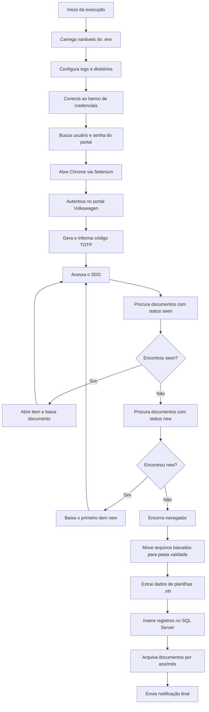

# RPA Document Pipeline

Automação RPA em Python para autenticar no portal Volkswagen, localizar documentos de garantia no SDD, baixar arquivos pendentes, validar e organizar os documentos, extrair dados de planilhas Excel e persistir as informações em SQL Server para consumo analítico/BI.

Este projeto demonstra uma esteira completa de automação corporativa: **navegação web com Selenium**, **MFA/TOTP**, **download controlado de documentos**, **tratamento de arquivos Excel/PDF**, **carga em banco de dados**, **organização em diretórios por competência**, **logs operacionais** e **notificações via Telegram**.

---

## Sumário

- [Visão geral](#visão-geral)
- [Objetivos do projeto](#objetivos-do-projeto)
- [Fluxo funcional](#fluxo-funcional)
- [Arquitetura da solução](#arquitetura-da-solução)
- [Tecnologias utilizadas](#tecnologias-utilizadas)
- [Estrutura do repositório](#estrutura-do-repositório)
- [Pré-requisitos](#pré-requisitos)
- [Configuração de ambiente](#configuração-de-ambiente)
- [Como executar](#como-executar)
- [Variáveis de ambiente](#variáveis-de-ambiente)
- [Detalhes do processamento](#detalhes-do-processamento)
- [Banco de dados](#banco-de-dados)
- [Logs e observabilidade](#logs-e-observabilidade)
- [Notificações](#notificações)
- [Tratamento de erros](#tratamento-de-erros)
- [Segurança e boas práticas](#segurança-e-boas-práticas)
- [Possíveis evoluções](#possíveis-evoluções)
- [Competências demonstradas](#competências-demonstradas)

---

## Visão geral

O `rpa-document-pipeline` automatiza uma rotina operacional de garantia. O robô acessa o portal Volkswagen com credenciais corporativas, aplica autenticação de múltiplos fatores via TOTP, navega até o ambiente SDD, identifica documentos com status **seen** ou **new**, realiza o download, aguarda a conclusão dos arquivos, move os documentos para pastas de validação e, quando encontra planilhas `.xls`, extrai os dados para a tabela SQL Server `[dbo].[Garantia_Volks]`.

Ao final do processo, os arquivos são armazenados em uma estrutura organizada por ano e mês, e a equipe recebe notificações informando sucesso, ausência de novos documentos ou falhas relevantes.

---

## Objetivos do projeto

- Reduzir esforço manual no acompanhamento de documentos de garantia.
- Garantir padronização na captura, validação e arquivamento de arquivos.
- Alimentar uma base SQL Server para relatórios e dashboards de BI.
- Registrar logs de execução para auditoria e troubleshooting.
- Notificar áreas responsáveis sobre sucesso, pendências ou falhas do processo.
- Demonstrar uma solução RPA ponta a ponta com integração web, arquivos, banco e mensageria.

---

## Fluxo funcional



---

## Arquitetura da solução

A solução é composta por uma camada principal de orquestração (`rpa_pipeline.py`) e dependências externas encapsuladas no pacote `SolutionPacket`.

| Componente | Responsabilidade |
| --- | --- |
| `rpa_pipeline.py` | Orquestra todo o fluxo: configuração, login, download, movimentação de arquivos, extração e carga no banco. |
| `SolutionPacket.Solution_bank.Bank` | Abstrai a conexão com bancos SQL Server. |
| `SolutionPacket.Solution_telegram.TelegramSend` | Envia mensagens e imagens para chats do Telegram. |
| `SolutionPacket.Solution_email.Smtp` | Disponibiliza integração de e-mail para o contexto do processo. |
| Selenium + ChromeDriver | Automatiza navegação, autenticação, cliques e downloads no portal. |
| Pandas/OpenPyXL/XLRD | Lê e transforma planilhas Excel antes da carga no banco. |

> Observação: o pacote `SolutionPacket` não está versionado neste repositório. Ele esta disponível no ambiente de execução e foi substituído por implementações equivalentes para demonstração.

---

## Tecnologias utilizadas

- **Python 3.x**
- **Selenium WebDriver** para automação web
- **webdriver-manager** para gerenciamento do ChromeDriver
- **pyotp** para geração de código TOTP/MFA
- **python-dotenv** para configuração via `.env`
- **pandas**, **openpyxl** e **xlrd** para leitura de Excel
- **SQL Server** para persistência dos dados
- **Telegram Bot API** para notificações operacionais
- **Logging nativo do Python** para observabilidade

---

## Estrutura do repositório

```text
rpa-document-pipeline/
├── README.md
└── rpa_pipeline.py
```

Diretórios criados/utilizados em tempo de execução:

```text
rpa-document-pipeline/
├── Arquivos/                  # Diretório local de download do Chrome
├── logs/                      # Logs diários da automação
└── erro_Garantia.png          # Screenshot gerado em falhas de login, quando aplicável
```

Além dos diretórios locais, o robô utiliza pastas externas configuradas por variável de ambiente para validação e arquivamento definitivo.

---

## Pré-requisitos

Antes de executar o projeto, garanta que o ambiente tenha:

1. Python 3 instalado.
2. Google Chrome instalado.
3. Acesso de rede ao portal Volkswagen utilizado pelo processo.
4. Acesso ao SQL Server de credenciais.
5. Acesso ao SQL Server de destino da rotina RPA.
6. Token e chats configurados para o bot do Telegram.
7. Chave TOTP válida para autenticação MFA.
8. Pacote `SolutionPacket` disponível no `PYTHONPATH` ou instalado no ambiente.
9. Locale `pt_BR.UTF-8` disponível no sistema operacional.
10. Permissões de leitura/escrita nas pastas configuradas em `PASTA_BASE`, `PASTA_VALIDADA` e `PASTA_QUALIDADE`.

---

## Configuração de ambiente

Crie e ative um ambiente virtual:

```bash
python -m venv .venv
source .venv/bin/activate
```

Instale as dependências principais:

```bash
pip install selenium webdriver-manager python-dotenv pandas openpyxl xlrd pyotp
```

Caso o pacote `SolutionPacket` seja distribuído internamente, instale-o conforme o padrão da organização, por exemplo:

```bash
pip install /caminho/para/SolutionPacket
```

Crie o arquivo `.env` na raiz do projeto com as variáveis necessárias.

---

## Como executar

Com o ambiente configurado, execute:

```bash
python rpa_pipeline.py
```

Durante a execução, o robô irá:

1. Criar a pasta `logs/`, caso não exista.
2. Carregar variáveis do `.env`.
3. Configurar pastas por ano/mês, quando necessário.
4. Conectar aos bancos configurados.
5. Abrir o Chrome e autenticar no portal.
6. Baixar os documentos disponíveis.
7. Processar planilhas e mover arquivos.
8. Enviar mensagens de acompanhamento.

---

## Variáveis de ambiente

| Variável | Descrição |
| --- | --- |
| `TELEGRAM_TOKEN` | Token do bot utilizado para envio de notificações. |
| `TELEGRAM_CHAT_ID` | Chat de destino para mensagens gerais do processo. |
| `TELEGRAM_CHAT_ID_RPA` | Chat de destino para alertas técnicos/RPA. |
| `TOTP_KEY` | Chave secreta usada para gerar o código TOTP do MFA. |
| `PASTA_BASE` | Pasta base onde a estrutura anual/mensal pode ser criada. |
| `PASTA_VALIDADA` | Pasta intermediária para arquivos baixados e validados. |
| `PASTA_QUALIDADE` | Pasta final de arquivamento por ano e mês. |
| `BANK_CRED_USER` | Usuário do banco de credenciais. |
| `BANK_CRED_PASS` | Senha do banco de credenciais. |
| `BANK_CRED_HOST` | Host/servidor do banco de credenciais. |
| `BANK_CRED_DB` | Database do banco de credenciais. |
| `BANK_RPA_USER` | Usuário do banco de destino RPA. |
| `BANK_RPA_PASS` | Senha do banco de destino RPA. |
| `BANK_RPA_HOST` | Host/servidor do banco de destino RPA. |
| `BANK_RPA_DB` | Database do banco de destino RPA. |

Exemplo de `.env` sem valores reais:

```env
TELEGRAM_TOKEN=000000000:xxxxxxxxxxxxxxxxxxxxxxxxxxxxxxxxxxx
TELEGRAM_CHAT_ID=-1000000000000
TELEGRAM_CHAT_ID_RPA=-1000000000001
TOTP_KEY=BASE32SECRET
PASTA_BASE=/dados/garantia/base
PASTA_VALIDADA=/dados/garantia/validada
PASTA_QUALIDADE=/dados/qualidade
BANK_CRED_USER=usuario_credenciais
BANK_CRED_PASS=senha_credenciais
BANK_CRED_HOST=servidor_credenciais
BANK_CRED_DB=database_credenciais
BANK_RPA_USER=usuario_rpa
BANK_RPA_PASS=senha_rpa
BANK_RPA_HOST=servidor_rpa
BANK_RPA_DB=database_rpa
```

> Nunca versionar `.env`, tokens, senhas, chaves TOTP ou credenciais reais.

---

## Detalhes do processamento

### 1. Inicialização

O script configura logging diário, carrega o `.env`, define variáveis globais de execução e prepara a estrutura de meses em português.

### 2. Login e autenticação

O robô busca usuário e senha no banco de credenciais, abre o Chrome com diretório de download controlado e acessa a URL do portal Volkswagen. Em seguida, envia usuário, senha e código TOTP gerado em tempo real.

### 3. Busca de documentos no SDD

A automação entra em loop no SDD e prioriza documentos com status `seen`. Se nenhum item `seen` estiver disponível, procura documentos `new`. Quando não existem arquivos novos ou pendentes, encerra a etapa de navegação e notifica a equipe.

### 4. Download controlado

Antes de clicar no link do documento, o script captura a lista de arquivos existentes no diretório de download. Após o clique, aguarda até que arquivos temporários como `.crdownload` ou `.tmp` deixem de existir, reduzindo o risco de mover arquivos incompletos.

### 5. Validação e movimentação

Arquivos `.xls` e `.pdf` baixados são movidos para `PASTA_VALIDADA`. Depois, planilhas `.xls` são processadas e todos os arquivos elegíveis são movidos para `PASTA_QUALIDADE/<ano>/<mês>`.

### 6. Extração de dados

A função de extração lê planilhas Excel, identifica a linha de cabeçalho a partir do marcador `Número de Operação`, normaliza datas e campos numéricos e gera comandos `INSERT` para a tabela `[dbo].[Garantia_Volks]`.

---

## Banco de dados

O projeto utiliza duas conexões:

1. **Banco de credenciais**: consulta a view `[datadriven_paranoa].[dbo].[dw_view_acessos_rpa]` para recuperar usuário e senha do portal.
2. **Banco RPA/destino**: grava dados extraídos na tabela `[dbo].[Garantia_Volks]`.

Tabela de destino esperada:

```sql
[dbo].[Garantia_Volks]
```

Principais grupos de campos persistidos:

- Identificação da operação e reclamação.
- Códigos de peça, dano, reparação e módulo.
- Dados do veículo, VIN, modelo e datas.
- Informações de concessionária e tipo de garantia.
- Custos, valores debitados e valores reclamados.
- Metadados de execução, como mês de criação e data de execução.

---

## Logs e observabilidade

Os logs são gravados em:

```text
logs/garantia_YYYYMMDD.log
```

Também são exibidos no console durante a execução. Eventos relevantes registrados:

- Início de downloads.
- Arquivos baixados.
- Inserts realizados.
- Ausência de documentos pendentes.
- Falhas de login, portal, leitura de planilhas ou inserção no banco.

---

## Notificações

O robô envia mensagens via Telegram para:

- Avisar que não existem arquivos novos ou pendentes.
- Informar quantidade de garantias processadas e disponíveis no BI.
- Alertar senha expirada.
- Reportar falhas no portal SDD.
- Enviar screenshot em caso de erro de login.

---

## Tratamento de erros

O processo possui tratamento em pontos críticos:

- Falhas de parsing de data retornam uma data padrão segura (`01/01/2001`).
- Downloads possuem timeout para evitar espera infinita.
- Erros de processamento por item são registrados sem interromper todo o fluxo.
- Erros no portal SDD são notificados ao chat técnico.
- Falha de login gera screenshot para facilitar diagnóstico.
- Erros de insert são registrados em log para análise posterior.

---

## Segurança e boas práticas

Para uso corporativo, recomenda-se:

- Armazenar segredos somente em cofre de credenciais ou variáveis de ambiente protegidas.
- Não versionar `.env`, screenshots com dados sensíveis, logs ou arquivos baixados.
- Restringir permissões das contas de banco ao mínimo necessário.
- Revisar a política de retenção dos documentos arquivados.
- Parametrizar comandos SQL para reduzir risco de falhas com caracteres especiais e melhorar segurança.
- Executar a rotina em servidor controlado, com usuário de serviço e monitoramento.
- Implementar rotação de logs e alertas para falhas recorrentes.

---

## Possíveis evoluções

- Criar `requirements.txt` ou `pyproject.toml` para padronizar dependências.
- Adicionar `.gitignore` para arquivos locais, logs, downloads, `.env` e ambientes virtuais.
- Separar o script em módulos: configuração, portal, download, extração, banco e notificações.
- Substituir SQL montado por string por queries parametrizadas.
- Implementar testes unitários para parsing de datas e transformação de planilhas.
- Adicionar modo headless configurável para execução em servidor.
- Criar camada de retry/backoff para instabilidades do portal.
- Registrar métricas de execução, tempo por etapa e volume processado.
- Containerizar a aplicação com Docker.
- Incluir pipeline de CI para lint, testes e validação de formatação.

---

## Competências demonstradas

Este projeto é um bom case para entrevistas por demonstrar experiência prática em:

- Automação RPA com Selenium em ambiente real.
- Integração com sistemas legados e portais autenticados.
- Autenticação MFA com TOTP.
- Orquestração de downloads e manipulação de arquivos.
- ETL com Python, Pandas e Excel.
- Persistência em SQL Server.
- Observabilidade com logs estruturados.
- Notificações operacionais via Telegram.
- Tratamento de exceções em processos críticos.
- Organização de documentos por competência.
- Visão de melhoria contínua e sustentação de automações corporativas.

---
